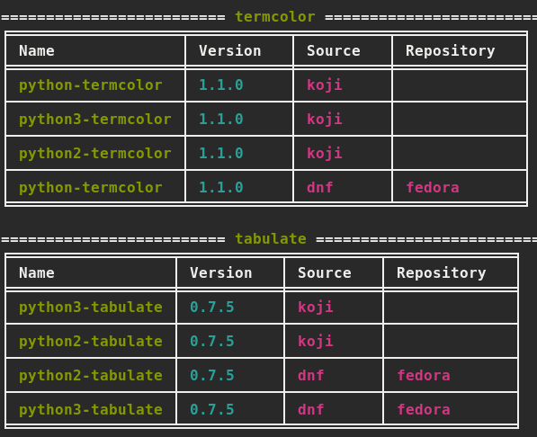

ReqWise
=======

ReqWise allows you to:

* Convert list of pip packages to RPMs based on search results
* Search for RPMs in multiple different sources (See 'Supported Sources')

Install
-------

Note: to use ReqWise you need to install python-dnf RPM since it's not available as pip

To install reqwise on your system, run the following command:

    sudo dnf install -y python-dnf koji
    sudo pip install .

You may also run the script 'scripts/quick_install.sh' for quick installation.

Supported Sources
-----------------

- YUM/DNF (system defined repositories)
- COPR    (https://copr.fedorainfracloud.org)
- Koji    (http://koji.fedoraproject.org)

Note: by default ReqWise will search only in YUM/DNF.

Usage
-----

You can use reqwise as CLI utility or as a python module in your programs.

### CLI

Search for RPMs in YUM/DNF with the requirement files in the current directory:

    reqwise

Search the requirements in COPR:

    reqwise --copr el7-rhos9-test-deps

Convert from pip to RPM, without searching for the RPM in the different sources:

    reqwise --convert-only

By default, reqwise will look for RPM short version (x.y.z), you can search for the long version (x.y.z-w):

    reqwise --long

### Configuration (Optional)

Can be set in your current working directory (reqwise.conf) or
in '/etc/reqwise/reqwise.conf'

The configuration file consists of sources. Source is where reqwise
will look for your requirement

An example for configration file:

    [copr]
    el7-rhos9-test-deps
    el7-rhos10-test-deps

    [koji]
    disabled=True

    [yum]
    repos=my_repo,another_repo
